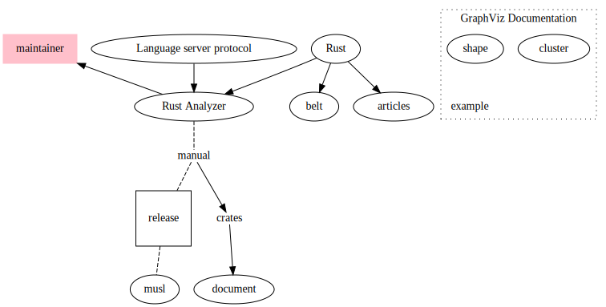

# Kent
Kent University a graph of webpages.
This is my first use of graphviz and working with dot language. Since I am very devoted to the idea of documenting everything I learn, I keep the record of my progress with this repository working with GraphViz and as a by product I'll have a graph of webpages in Kent University, for those who are interested in applying to this university.

look at this:
https://medium.com/learning-from-learners/learners-guide-to-coq-theorem-prover-1-e380c9e360b8
and this:
https://softwarefoundations.cis.upenn.edu/
and this:
https://www.pm.inf.ethz.ch/research/prusti.html
http://adam.chlipala.net/cpdt/

I am learning more about Coq, separation logic, dependent types, and Rust state of development.

https://beuke.org/coq-tutorial/
