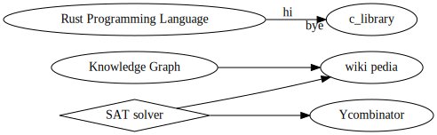

# Kent
Kent University a graph of webpages.
This is my first use of graphviz and working with dot language. Since I am very devoted to the idea of documenting everything I learn, I keep the record of my progress with this repository working with GraphViz and as a by product I'll have a graph of webpages in Kent University, for those who are interested in applying to this university.

